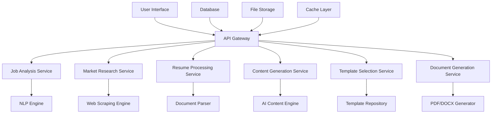

# AI Resume Builder - Design Document

## Overview

The AI Resume Builder is a microservices-based system that combines Natural Language Processing, web scraping, AI content generation, and document rendering to create tailored, ATS-optimized resumes. The system follows a pipeline architecture where each component processes data sequentially while maintaining modularity and scalability.

## Architecture

### High-Level Architecture



### System Components

1. **API Gateway**: Central entry point handling authentication, rate limiting, and request routing
2. **Job Analysis Service**: Processes job descriptions using NLP to extract requirements
3. **Market Research Service**: Conducts web-based research for industry benchmarking
4. **Resume Processing Service**: Handles existing resume parsing and content extraction
5. **Content Generation Service**: Creates AI-generated resume content
6. **Template Selection Service**: Chooses optimal resume templates based on context
7. **Document Generation Service**: Renders final resume documents in multiple formats

## Components and Interfaces

### Job Analysis Service

**Purpose**: Extract structured data from job descriptions using NLP

**Key Methods**:
- `analyzeJobDescription(text: string): JobRequirements`
- `extractSkills(text: string): Skill[]`
- `categorizeRequirements(requirements: JobRequirements): CategorizedRequirements`

**Dependencies**: 
- NLP Engine (OpenAI GPT-4 or Claude 3)
- Skills taxonomy database

**Input**: Raw job description text, PDF, or URL
**Output**: Structured job requirements with skills, qualifications, and keywords

### Market Research Service

**Purpose**: Gather competitive intelligence and industry benchmarks

**Key Methods**:
- `researchSimilarRoles(jobTitle: string, industry: string): MarketData`
- `getTrendingSkills(role: string): TrendingSkills`
- `benchmarkResumes(jobRequirements: JobRequirements): BenchmarkData`

**Dependencies**:
- Web scraping APIs (Scrapy, Selenium)
- Search APIs (Google Custom Search, Bing)
- Resume databases and job boards

**Input**: Job requirements and role information
**Output**: Market trends, competitive data, and best practices

### Resume Processing Service

**Purpose**: Parse and analyze existing user resumes

**Key Methods**:
- `parseResume(file: File): ParsedResume`
- `extractPersonalInfo(resume: ParsedResume): PersonalInfo`
- `mapToJobRequirements(resume: ParsedResume, jobReqs: JobRequirements): MappedContent`

**Dependencies**:
- Document parsers (PyPDF2, docx2txt, AWS Textract)
- Text extraction libraries

**Input**: Resume files (PDF, DOCX, TXT)
**Output**: Structured resume data with personal info, experience, skills

### Content Generation Service

**Purpose**: Generate human-like, professional resume content

**Key Methods**:
- `generateSummary(profile: UserProfile, jobReqs: JobRequirements): string`
- `createBulletPoints(experience: Experience[], jobReqs: JobRequirements): BulletPoint[]`
- `optimizeForATS(content: ResumeContent, keywords: string[]): OptimizedContent`

**Dependencies**:
- AI language models (GPT-4, Claude 3)
- Content templates and style guides
- ATS optimization rules

**Input**: User profile, job requirements, existing content
**Output**: AI-generated resume sections with ATS optimization

### Template Selection Service

**Purpose**: Choose optimal resume layout and design

**Key Methods**:
- `selectTemplate(industry: string, roleLevel: string, content: ResumeContent): Template`
- `customizeLayout(template: Template, content: ResumeContent): CustomizedTemplate`
- `validateDesign(template: Template): ValidationResult`

**Dependencies**:
- Template repository with multiple designs
- Industry-specific design rules
- Content-to-design mapping algorithms

**Input**: Industry, role level, content structure
**Output**: Selected and customized template

### Document Generation Service

**Purpose**: Render final resume documents in multiple formats

**Key Methods**:
- `generatePDF(content: ResumeContent, template: Template): PDFDocument`
- `generateDOCX(content: ResumeContent, template: Template): DOCXDocument`
- `calculateOptimizationScore(resume: Resume, jobReqs: JobRequirements): OptimizationScore`

**Dependencies**:
- PDF generation (jsPDF, Puppeteer)
- DOCX generation (docx library)
- Document styling engines

**Input**: Resume content and selected template
**Output**: Formatted documents with optimization metrics

## Data Models

### Core Data Models

```typescript
interface JobRequirements {
  id: string;
  title: string;
  company: string;
  skills: Skill[];
  qualifications: Qualification[];
  responsibilities: string[];
  keywords: string[];
  experienceLevel: ExperienceLevel;
  industry: string;
  location: string;
  createdAt: Date;
}

interface Skill {
  name: string;
  category: SkillCategory;
  importance: ImportanceLevel;
  synonyms: string[];
}

interface UserProfile {
  id: string;
  personalInfo: PersonalInfo;
  education: Education[];
  experience: Experience[];
  skills: Skill[];
  achievements: Achievement[];
  preferences: UserPreferences;
}

interface ResumeContent {
  summary: string;
  experience: FormattedExperience[];
  education: FormattedEducation[];
  skills: FormattedSkills;
  achievements: FormattedAchievement[];
  additionalSections: AdditionalSection[];
}

interface OptimizationScore {
  atsCompatibility: number; // 0-100
  keywordMatch: number; // 0-100
  roleAlignment: number; // 0-100
  overallScore: number; // 0-100
  recommendations: string[];
}
```

### Database Schema

**Users Table**:
- id, email, name, created_at, updated_at

**Job_Analyses Table**:
- id, user_id, job_description, extracted_requirements, created_at

**Resumes Table**:
- id, user_id, job_analysis_id, content, template_id, optimization_score, created_at

**Templates Table**:
- id, name, category, industry, role_level, html_template, css_styles

**Market_Research Table**:
- id, job_title, industry, trending_skills, benchmark_data, research_date

## Error Handling

### Error Categories

1. **Input Validation Errors**
   - Invalid job description format
   - Unsupported resume file types
   - Missing required user information

2. **Processing Errors**
   - NLP analysis failures
   - Web scraping timeouts
   - AI content generation errors

3. **System Errors**
   - Database connection failures
   - External API rate limits
   - Document generation failures

### Error Handling Strategy

```typescript
interface ErrorResponse {
  code: string;
  message: string;
  details?: any;
  suggestions?: string[];
}

// Error handling middleware
class ErrorHandler {
  handleJobAnalysisError(error: Error): ErrorResponse
  handleContentGenerationError(error: Error): ErrorResponse
  handleDocumentGenerationError(error: Error): ErrorResponse
  provideFallbackResponse(originalRequest: any): FallbackResponse
}
```

### Fallback Mechanisms

- **Job Analysis Failure**: Use predefined skill taxonomies and keyword extraction
- **Market Research Failure**: Fall back to cached industry data and standard templates
- **AI Content Generation Failure**: Use template-based content with user input
- **Template Selection Failure**: Default to professional corporate template

## Testing Strategy

### Unit Testing
- Test individual service methods with mock dependencies
- Validate data model transformations and business logic
- Test error handling and edge cases for each component

### Integration Testing
- Test service-to-service communication and data flow
- Validate end-to-end pipeline from job description to resume generation
- Test external API integrations with mock responses

### Performance Testing
- Load testing for concurrent resume generation requests
- Stress testing for large job descriptions and complex resumes
- Response time validation for each service component

### Quality Assurance
- Resume content quality validation with human reviewers
- ATS compatibility testing with real ATS systems
- Cross-format document generation validation (PDF vs DOCX)

### Test Data Management
- Anonymized sample job descriptions and resumes
- Mock API responses for external services
- Template variations for different industries and roles

## Security Considerations

### Data Protection
- Encrypt user personal information and resume content
- Implement secure file upload and storage
- Regular data purging for inactive accounts

### API Security
- Rate limiting to prevent abuse
- Authentication and authorization for all endpoints
- Input sanitization and validation

### Privacy Compliance
- GDPR compliance for European users
- Data retention policies and user consent management
- Secure data deletion upon user request
